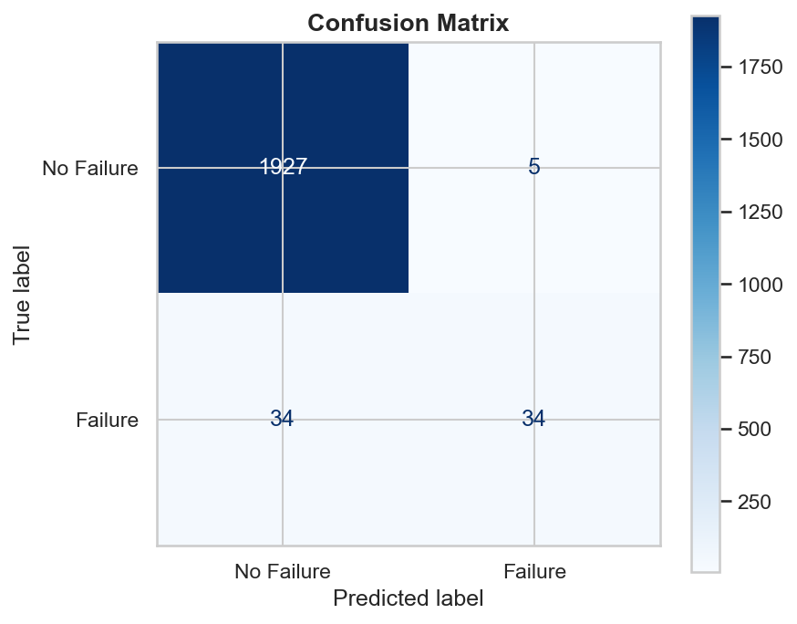
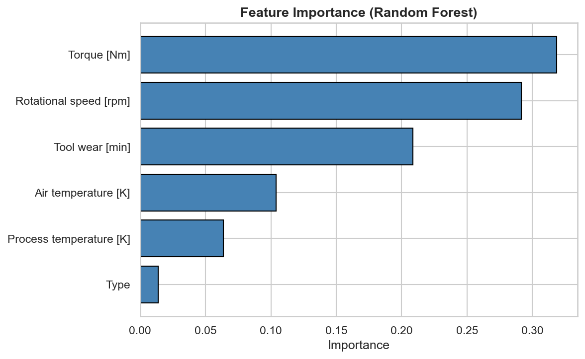
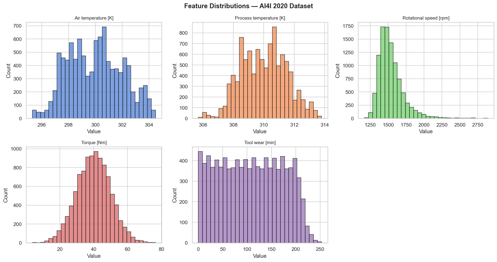
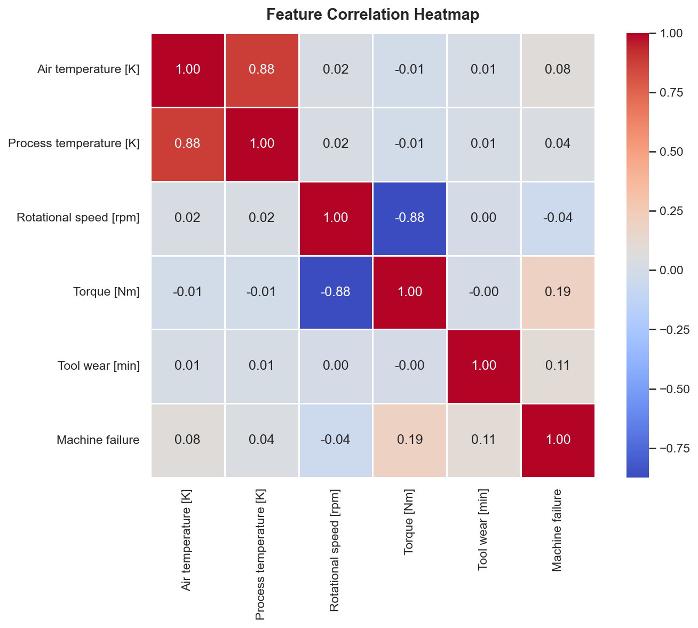
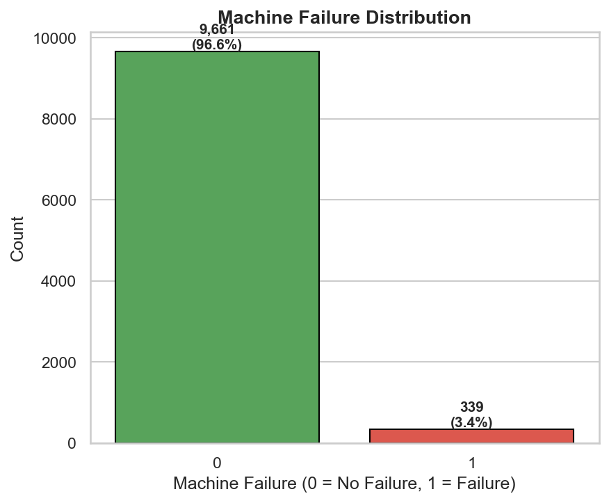
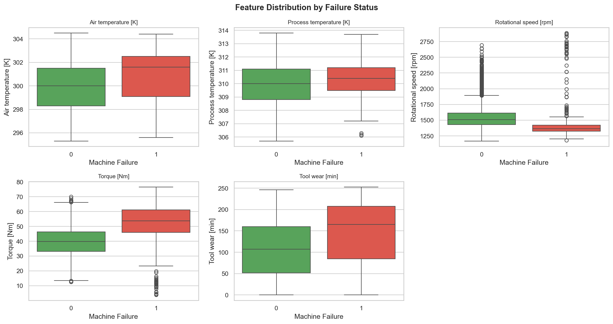

# 🏭 Industrial Machine Failure Prediction System


A machine-learning system that predicts industrial machine failures **before they happen**, using real-time sensor data and a trained Random Forest classifier.

---

## 📋 Project Overview

Unplanned machine failures in industrial settings lead to costly downtime and safety risks. This project builds a **predictive maintenance model** that analyses sensor readings — temperature, rotational speed, torque, and tool wear — to classify whether a machine is likely to fail.

- **Algorithm**: Random Forest Classifier (balanced class weights)
- **Dataset**: [AI4I 2020 Predictive Maintenance Dataset](https://archive.ics.uci.edu/ml/datasets/AI4I+2020+Predictive+Maintenance+Dataset) — UCI Machine Learning Repository
- **Task**: Binary classification (Failure vs. No Failure)

---

## 🔧 Technologies Used

| Technology | Version | Purpose |
|---|---|---|
| Python | 3.8+ | Core language |
| pandas | 1.5+ | Data loading & manipulation |
| NumPy | 1.23+ | Numerical operations |
| scikit-learn | 1.2+ | Preprocessing, training, evaluation |
| matplotlib | 3.6+ | Plotting & visualisation |
| seaborn | 0.12+ | Statistical plots (heatmaps, box plots) |

---

## 📊 Dataset Description

**Source**: AI4I 2020 Predictive Maintenance Dataset  
**Records**: 10,000 | **Columns**: 14

| Feature | Description | Unit |
|---|---|---|
| Type | Product quality variant (H / M / L) | — |
| Air temperature | Air temperature around the machine | K |
| Process temperature | Internal process temperature | K |
| Rotational speed | Spindle rotational speed | rpm |
| Torque | Torque applied by the machine | Nm |
| Tool wear | Cumulative tool wear time | min |
| **Machine failure** | **Target** — 0 (No Failure) or 1 (Failure) | — |

---

## 🚀 Installation

```bash
# Clone the repository
git clone https://github.com/<your-username>/predictive-maintenance.git
cd predictive-maintenance

# Install dependencies
pip install -r requirements.txt
```

---

## ⚙️ Usage

### Train the Model

Runs the full pipeline: data loading → preprocessing → EDA → training → evaluation → model saving.

```bash
python main.py train
```

### Run Predictions

**Interactive mode** — prompts for each parameter:

```bash
python main.py predict
```

**With CLI arguments**:

```bash
python main.py predict --type M --air-temp 298.1 --process-temp 308.6 --rpm 1551 --torque 42.8 --tool-wear 0
```

**Example output**:

```
========================================
  Machine Failure Prediction System
========================================

Input Parameters:
  Type               : M
  Air Temperature    : 298.1 K
  Process Temperature: 308.6 K
  Rotational Speed   : 1551 rpm
  Torque             : 42.8 Nm
  Tool Wear          : 0 min

✅ Machine Status: Safe
   The machine is operating within normal parameters.
```

### Run EDA Only

Generate exploratory data analysis plots without training:

```bash
python main.py eda
```

---

## 📁 Project Structure

```
predictive-maintenance/
│
├── data/                          # Raw dataset
│   └── ai4i2020.csv
│
├── models/                        # Saved trained models & preprocessors
│   ├── random_forest_model.pkl
│   ├── scaler.pkl
│   └── label_encoder.pkl
│
├── notebooks/                     # Jupyter notebooks for exploration
│   └── exploration.ipynb
│
├── outputs/                       # Generated plots and reports
│   ├── feature_distributions.png
│   ├── correlation_heatmap.png
│   ├── failure_distribution.png
│   ├── failure_boxplots.png
│   ├── confusion_matrix.png
│   └── feature_importance.png
│
├── src/                           # Source code modules
│   ├── __init__.py
│   ├── data_preprocessing.py      # Data loading, cleaning, scaling
│   ├── eda.py                     # Exploratory data analysis plots
│   ├── model_training.py          # Model training & evaluation
│   ├── model_utils.py             # Save / load model utilities
│   └── predict.py                 # Single-sample prediction logic
│
├── main.py                        # CLI entry point (train / predict / eda)
├── requirements.txt               # Python dependencies
└── README.md                      # Project documentation
```

---

## 📈 Results

### Model Performance

The Random Forest classifier achieves strong accuracy with balanced class weights to handle the imbalanced dataset.

### Confusion Matrix



### Feature Importance



---

## 📊 EDA Highlights

### Feature Distributions



### Correlation Heatmap



### Failure Distribution



### Feature Box Plots by Failure Status



---

## 📄 License

This project is licensed under the **MIT License** — see the [LICENSE](LICENSE) file for details.

---

## 🙏 Acknowledgements

- **Dataset**: [AI4I 2020 Predictive Maintenance Dataset](https://archive.ics.uci.edu/ml/datasets/AI4I+2020+Predictive+Maintenance+Dataset) — UCI Machine Learning Repository
- **Tools**: scikit-learn, pandas, matplotlib, seaborn
